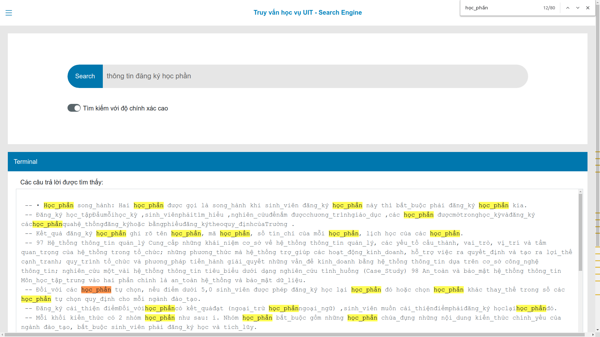

# TruyVanHocVuUIT
Lớp CS336.L12.KHCL 
- GV: Nguyễn Vinh Tiệp 
 + SV : Nguyễn Hữu Tiền Khôi 17520650
 + SV : Trần Hưng Đạt 17520340

Hệ thống hỏi đáp tự động học vụ UIT :
- Công cụ sử dụng :
 + Backend : Python, thư viện sử dụng : underthesea, spacy, flask, BeautifulSoup ...
 + FrontEnd : Nodejs + ReactJs

- Chi tiết được trình bày trong slide.
 
Chức năng ứng dụng:
- Hỗ trợ tìm kiếm thông tin học vụ, quy chế đào tạo, các quy định, quy trình của trường Đại học CNTT-HCM

Hướng dẫn cài đặt:
- Cài các thư viện underthesea, spacy, flask, BeautifulSoup trên python để chạy Backend
 + vd : `pip install underthesea`
- Vào thư mục fe/ : cd fe/
 + chạy lệnh : `npm install` để cài đặt các thư viện cho node 
 + chạy lệnh : `node server.js` để  run trang web
 + truy cập : localhost:3000/  
 

- Video demo : https://youtu.be/aZNCiHEVQWs
- Báo cáo : https://drive.google.com/drive/folders/18Tc6_S9XXQlPkLj8xfrulpuhwcUGC1Lj?usp=sharing